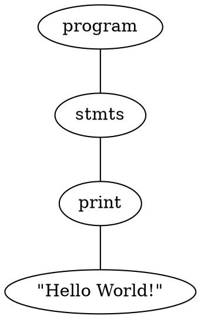
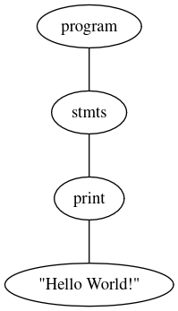

# Emoji Lang 😎

Emoji Lang is a programming language that uses emojis as tokens (assignment, control, operators, etc.). This repository includes the necessary code to build the compiler `build/emoji` that generates an object file which, together with a runtime `src/stdc.c`, becomes the program executable `build/program`.

## 📋 Requirements

- linux (tested on ubuntu 22.04)
- clang: 14.0.0
- gcc: 11.4.0
- flex: 2.6.4
- bison: 3.8.2
- llvm: 16.0.6

## 📁 Structure

- `emoji.l`
  - The lexer file written in Flex.
  - Performs lexical analysis: reads .emj source code and converts it into tokens (e.g., ✏️ → TOK_PRINT, 👈 → TOK_ATTR, etc.).
  - Recognizes identifiers, numbers, and strings.
  - Generates `emoji.yy.c`, which is later used by the parser.

- `emoji.y`
  - The parser file written in Bison.
  - Defines the grammar of the language.
  - Receives tokens from the lexer and builds the AST (Abstract Syntax Tree).
  - Defines operator precedence (➕, ✖️, etc.).
  - Calls code generation functions (through backllvm.h and AST nodes).
  - Generates `emoji.tab.c` and `emoji.tab.h`.

- `nodes.h`
  - Defines the Abstract Syntax Tree (AST) structure.
  - Each language construct (expressions, declarations, operators, control flow) is represented as a class/struct.
  - Acts as the bridge between syntax and code generation.

- `backllvm.h`
  - Responsible for the LLVM backend code generation.
  - Provides functions and utilities to translate AST nodes into LLVM IR or object code.
  - Emits LLVM instructions for arithmetic, control flow, and runtime calls.

- `main.cpp`
  - The compiler driver (entry point).
  - Parses command-line arguments (input.emj and output.o).
  - Initializes the parser `yyparse()`.

- `stdc.c`
  - Provides auxiliar functions such as printing strings and numbers.
  - Linked together with `program.o` to produce the final executable `program`.

## 🛠️ Build Compiler

To build the compiler binary `build/emoji`, run:

```bash
make build_compiler
```

What this produces:

- `build/emoji.tab.c`
- `build/emoji.tab.h`
- `build/emoji.yy.c`
- `build/emoji` (compiler)

## 🚀 Hello World

File `examples/hello.emj`:

```emj
✏️ "Hello World!";
```

Compile the program:

```bash
make compile_program FILE=examples/hello.emj
```

Run:

```bash
./build/program
```

✅ Espected output: `Hello World!`

Debug:

```bash
gdb --args build/emoji examples/hello.emj
```

## 📔 Documentation

### Declarations

- `🔡` — String declaration. Example: `🔡 name;`
- `🔢` — Numeric declaration (C lang float). Example: `🔢 age;`

### Identifiers and Literals

- Identifier: regex `{A}({A}|{D})*` → starts with a letter or underscore, may contain letters and digits. Examples: `sum`, `phrase`
- Integer: `{D}+` (e.g.: `69`)
- Float: `{D}*\.{D}+` (e.g.: `3.14`)
- String: `"..."` (supports escaped characters)

### Print

`✏️` — Print value to console. Examples:

```emj
✏️ "think different";
✏️ 69;
✏️ count;
```

### Assignment

`👈` — Assignment operator. Examples:

```emj
x 👈 5;
s 👈 "hi";
y 👈 x
```

### Increment / Decrement

- `⏩` — Increment `x++`. Example: `x⏩`
- `⏪` — Decrement `x--`. Example: `x⏪`

### Arithmetic Operators

- `➕` → `+`
- `➖` → `-`
- `✖️` → `*`
- `➗` → `/`

Example:
```emj
x 👈 1 ➕ 2 ✖️ 3;
```

### Comparison Operators

- `✅` → equal (`==`)
- `❗✅` → diff (`!=`)
- `👆` → greater (`>`)
- `👇` → less (`<`)
- `👆✅` → greater or equal (`>=`)
- `👇✅` → less or equal (`<=`)

### Logical Operators

- `⚖️` → AND (`&&`)
- `✌️` → OR (`||`)
- `❗` → NOT (`!`)

### Control Flow

- `🤔` → `if`
- `🙃` → `else`
- `🔁` → `while`
- Blocks: `⤵️` → `{` and `⤴️` → `}`

`if` example:

```emj
🤔 ( x ✅ 10 ) ⤵️
  ✏️ "x is 10";
⤴️
🙃 ⤵️
  ✏️ "x is not 10";
⤴️
```

`while` example:

```emj
🔁 ( x 👆 0 ) ⤵️
  ✏️ x;
  x⏪;
⤴️
```

### Punctuation / Grouping

- `;` — Statement terminator
- `(` `)` — Parentheses for expressions

## 🌳 Graphviz / AST visual

When compiling a program, the compiler generates a graph that represents the abstract syntax tree (AST), showing how the program's nodes are connected. You can view it directly on [Graphviz Online](https://dreampuf.github.io/GraphvizOnline/).

Result from `hello.emj`:





✅ Interpretation:

- `"program"` is the root node.
- `"stmts"` represents the list of statements.
- `"print"` is the print instruction.
- `"Hello World!"` is the value to be printed.

## 🤖 LLVM IR Code

In addition to the graph, the compilation also prints the LLVM IR (Intermediate Representation) in the terminal, which is a low-level intermediate representation of your program, but still readable.

Partial result from `hello.emj`:

```llvm
; ModuleID = 'llvm program'
source_filename = "llvm program"

@0 = private unnamed_addr constant [13 x i8] c"Hello World!\00", align 1

define i16 @main() {
entry:
  call void @printstr(ptr @0)
  ret i16 0
}

declare void @printfloat(double)
declare void @printstr(ptr)
```

✅ Interpretation:

- `@0` → constant that stores "Hello World!".
- `@main()` → the program's main function.
- `call void @printstr(ptr @0)` → calls the runtime function to print the string.
- `declare void @printfloat(double)` → declares the runtime function to print a float.

## 👨‍💻 Examples

- [Hello](examples/hello.emj)
- [Name and Age](examples/name-and-age.emj)
- [Conditions](examples/conditions.emj)
- [Counting](examples/counting.emj)
- [Lexical Error](examples/lexical-error.emj)
- [Syntactic Error](examples/syntactic-error.emj)
- [Semantic Error](examples/semantic-error.emj)
